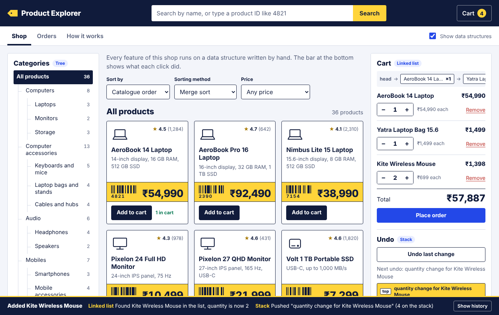
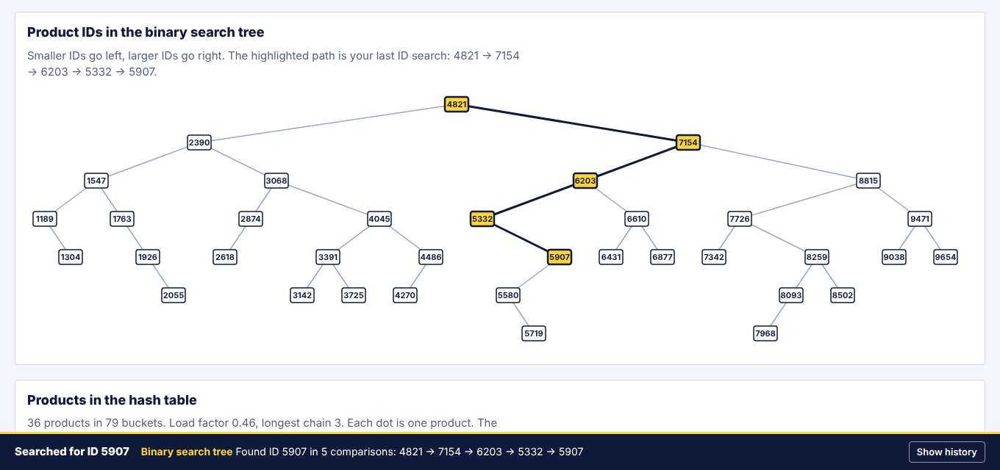
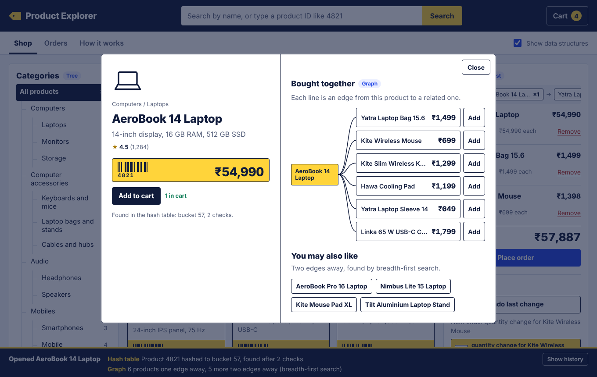
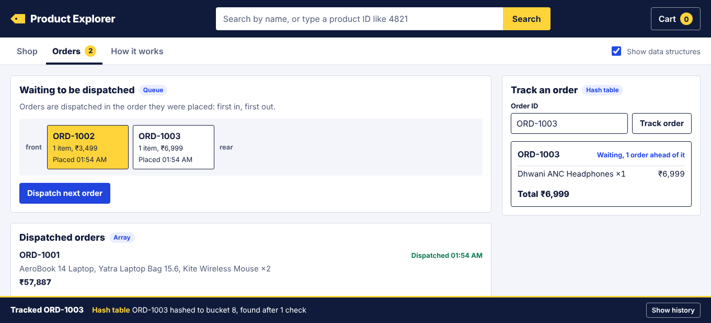

# E-Commerce Product Explorer

A small online shopping website where you can search, sort and explore products, keep a cart and track orders. Every feature runs on a data structure or algorithm written by hand in plain JavaScript, with no libraries.

**Live site:** https://shivam-pandyacoder24.github.io/E-Commerce-Product-Explorer/



## What it shows

The site is a working shop, and it also shows its own workings. Each panel is tagged with the data structure behind it, and a bar at the bottom of the page reports what each click did, for example "Merge sort: sorted 13 products by price in 33 comparisons".

| Topic | Feature in the shop | Code |
| --- | --- | --- |
| Array | Product catalogue | [`js/data.js`](js/data.js), [`js/store.js`](js/store.js) |
| Searching | Keyword search (linear search) and price ranges (binary search) | [`js/dsa/search.js`](js/dsa/search.js) |
| Sorting | Sort by price, rating or name with merge sort, quick sort or bubble sort | [`js/dsa/sort.js`](js/dsa/sort.js) |
| Linked list | Shopping cart | [`js/dsa/linked-list.js`](js/dsa/linked-list.js) |
| Stack | Undo for products added to or removed from the cart | [`js/dsa/stack.js`](js/dsa/stack.js) |
| Queue | Order processing, first in first out | [`js/dsa/queue.js`](js/dsa/queue.js) |
| Tree 1 | Product categories | [`js/dsa/category-tree.js`](js/dsa/category-tree.js) |
| Tree 2 | Product-ID binary search tree | [`js/dsa/bst.js`](js/dsa/bst.js) |
| Graph | Related products | [`js/dsa/graph.js`](js/dsa/graph.js) |
| Hashing | Product and order lookup by ID | [`js/dsa/hash-table.js`](js/dsa/hash-table.js) |

## Try it in one minute

1. Type `mouse` in the search box. Linear search checks all 36 products.
2. Type `5907`. A number is treated as a product ID and looked up in the binary search tree. Type `4800` to see the closest IDs suggested when there is no match.
3. Choose **Computer accessories** in the category tree, then sort by price. Switch the sorting method to bubble sort and compare the number of comparisons in the bottom bar.
4. Open **AeroBook 14 Laptop**. Its related products (laptop bag, mouse, keyboard, cooling pad) come from the graph.
5. Add a few products to the cart, remove one, then press **Undo last change** a few times.
6. Press **Place order**, open the **Orders** tab, dispatch the order and track it by its ID.
7. Open **How it works** to see the binary search tree and the hash table drawn from live data.

## How each data structure is used

**Array.** The catalogue is an array of 36 products. Every product list starts from it. A second copy, sorted by price, is kept for binary search.

**Searching.** Keywords use linear search, because any product could match. A price range uses two binary searches (lower bound and upper bound) on the price-sorted array, so only about 12 comparisons are needed to find the range.

**Sorting.** Merge sort, quick sort and bubble sort are all implemented and selectable. Each one counts its comparisons so they can be compared on the same data.

**Linked list.** The cart is a singly linked list. Each item is a node pointing to the next one. The cart panel draws the chain: `head → item → item → null`.

**Stack.** Every cart change (add, remove, quantity change) is pushed on a stack. Undo pops the latest change and reverses it, including putting a removed item back in its old position.

**Queue.** Placed orders join the rear of a circular-array queue. Dispatching always takes the order at the front. The graph's breadth-first search uses the same queue.

**Category tree.** Categories form a general tree. Choosing a category does a depth-first walk and collects every product below it. The breadcrumb is the path from that node back to the root.

**Binary search tree.** Products are inserted by product ID. A search follows one path from the root, and the page highlights that path. When an ID does not exist, the tree gives the closest IDs on either side, which a hash table cannot do.



**Graph.** Products are vertices, and an edge joins two products that are bought together. "Bought together" shows the direct neighbours. "You may also like" uses breadth-first search to find products two edges away.



**Hash table.** Products and orders are stored in a hash table with separate chaining, a polynomial string hash and a prime number of buckets. It grows and rehashes when it is more than 75% full.



## Time complexity

| Operation | Data structure | Time |
| --- | --- | --- |
| Keyword search | Array, linear search | O(n) |
| Price range | Sorted array, binary search | O(log n) |
| Sort results | Merge sort | O(n log n) |
| Sort results | Quick sort | O(n log n) average, O(n²) worst |
| Sort results | Bubble sort | O(n²) |
| Add to cart | Linked list | O(n) to check for the item, O(1) to append |
| Undo | Stack | O(1) to pop |
| Place or dispatch an order | Queue | O(1) |
| Choose a category | Tree, depth-first walk | O(size of the subtree) |
| Find a product by ID | Binary search tree | O(h), h = height of the tree (6 here) |
| Related products | Graph adjacency list | O(number of neighbours) |
| Look up a product or order | Hash table | O(1) average |

## Run it

No build step and nothing to install.

- **Online:** open the live site link above.
- **On your computer:** download the repository and open `index.html` in a browser.

### Tests

The data structures and the shop logic have 39 tests. They need only Node.js:

```
node tests/run-tests.js
```

## Project structure

```
index.html              the page
css/styles.css          all styling
js/
  data.js               products, categories and "bought together" pairs
  store.js              shop logic: where each data structure is used
  app.js                draws the page and handles clicks
  icons.js              product drawings
  dsa/
    search.js           linear search, binary search, lower and upper bound
    sort.js             merge sort, quick sort, bubble sort
    linked-list.js      singly linked list
    stack.js            stack
    queue.js            circular-array queue
    category-tree.js    general tree
    bst.js              binary search tree
    graph.js            undirected graph with breadth-first search
    hash-table.js       hash table with separate chaining
tests/run-tests.js      tests for every data structure and the store
docs/                   screenshots used in this README
```

## Built with

HTML, CSS and JavaScript. The products and brands are made up for the project, and nothing is saved between visits.

## Author

Shivam A Pandya ([@shivam-pandyacoder24](https://github.com/shivam-pandyacoder24))
